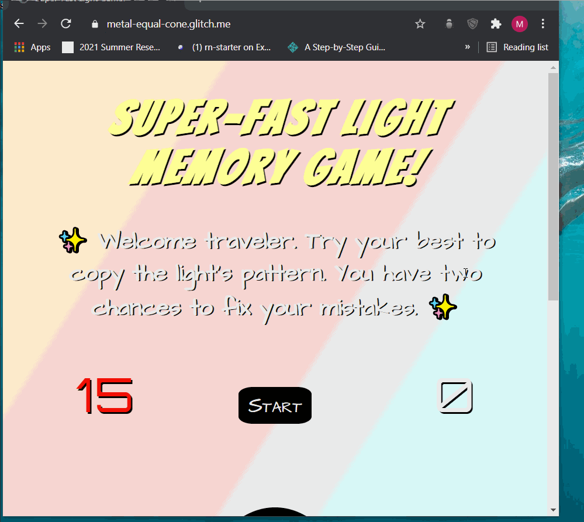
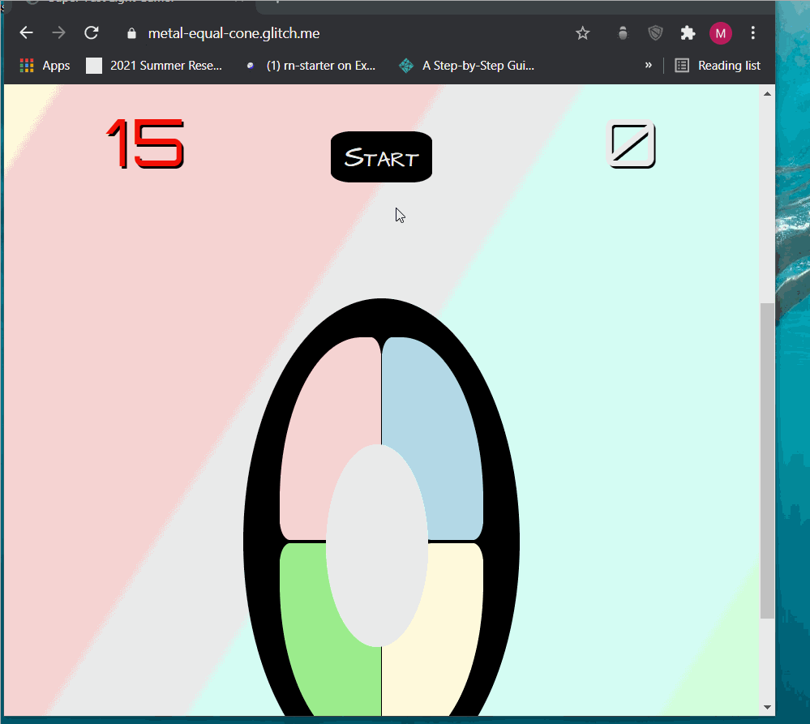
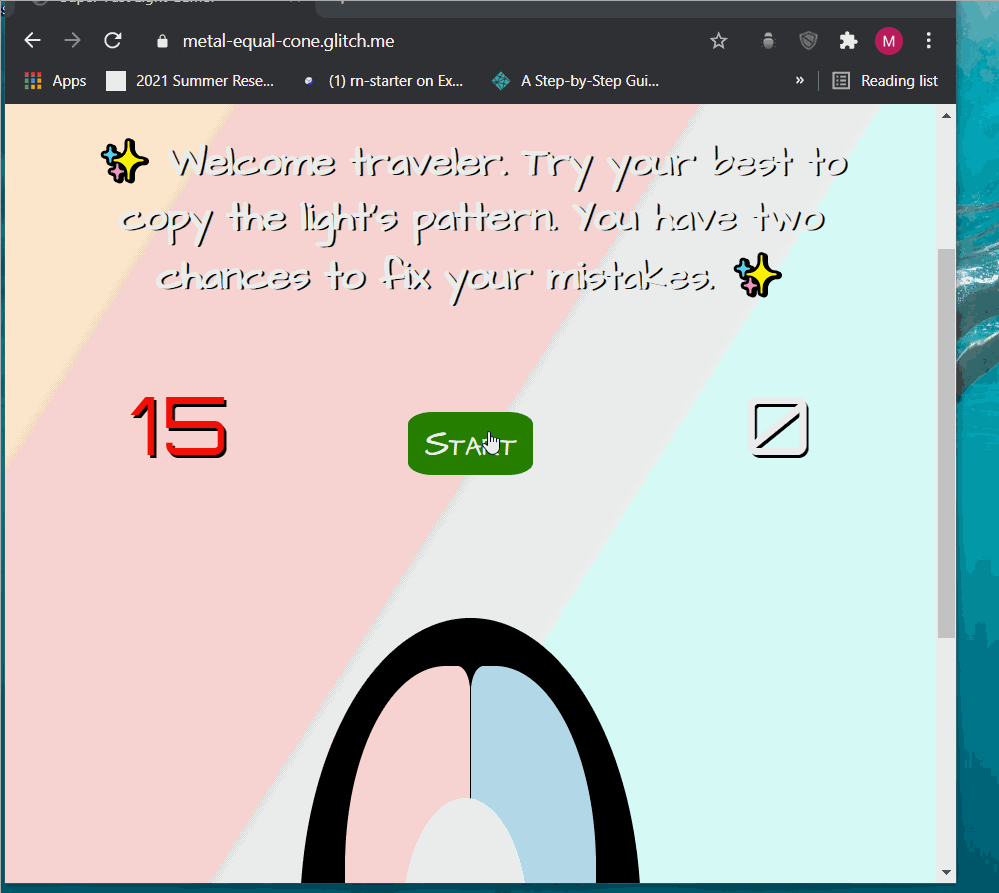

# Pre-work - _Memory Game_

**Memory Game** is a Light & Sound Memory game to apply for CodePath's SITE Program.

Submitted by: Melissa Marie Perez

Time spent: **25**

Link to project: <https://metal-equal-cone.glitch.me>

## Required Functionality

The following **required** functionality is complete:

- [x] Game interface has a heading (h1 tag), a line of body text (p tag), and four buttons that match the demo app
- [x] "Start" button toggles between "Start" and "Stop" when clicked.
- [x] Game buttons each light up and play a sound when clicked.
- [x] Computer plays back sequence of clues including sound and visual cue for each button
- [x] Play progresses to the next turn (the user gets the next step in the pattern) after a correct guess.
- [x] User wins the game after guessing a complete pattern
- [x] User loses the game after an incorrect guess

The following **optional** features are implemented:

- [x] Any HTML page elements (including game buttons) has been styled differently than in the tutorial
- [x] Buttons use a pitch (frequency) other than the ones in the tutorial
- [x] More than 4 functional game buttons
- [x] Playback speeds up on each turn
- [x] Computer picks a different pattern each time the game is played
- [x] Player only loses after 3 mistakes (instead of on the first mistake)
- [x] Game button appearance change goes beyond color (e.g. add an image)
- [x] Game button sound is more complex than a single tone (e.g. an audio file, a chord, a sequence of multiple tones)
- [] User has a limited amount of time to enter their guess on each turn

The following **additional** features are implemented:

- [x] Display remaining guesses
- [x] Flash red when user presses wrong button

## Video Walkthrough

Here's a walkthrough of implemented user stories:

## Reflection Questions

1. If you used any outside resources to help complete your submission (websites, books, people, etc) list them here.

   - w3schools.com
   - Udemy.com
   - CodePath
   - Mozilla Developer Network
   - htmlcolorcodes
   - stackoverflow
   - flaticon, Icon credits to Freepik
   - colorhunt
   - Google Fonts
   - Codepen
   - Mixkit
   - Convertio
   - Programminghead

2. What was a challenge you encountered in creating this submission (be specific)? How did you overcome it? (recommended 200 - 400 words)

   The implementation of playable audio files was a challenge I faced. When building websites that use assets, I normally have an assets folder where I place the images or sound files. To reference the files, I cite the relative or absolute path to the file. Glitch delivers content differently. Although, there is an “assets” box, files are not stored locally on the Glitch server. Instead, you directly reference the generated URL provided by Glitch. It made deciphering the error much more difficult, as “Missing file” errors would be generated in cases where the path is wrong, or the file does not exist.

   After spending time trying to correct this error, I searched for more information on Glitch and found a tutorial that explained how to access “assets”. From there, it was a simple fix to add the URL to the audio tag’s src property without any paths. The next hurdle was having the JavaScript event listener play the file. Although I was grabbing the correct audio element, I was still receiving errors about “Promises” not being satisfied. I have yet to learn about the topic, but the idea was that the play method was not given the promised audio. After various stackoverflow visits, I found a vaguely familiar question where I realized that I was not tapping into the audio elements “src” property. Once I added .src, my memory game was able to play the audio files.

3) What questions about web development do you have after completing your submission? (recommended 100 - 300 words)
   - How are technologies determined when designing a website?
   - Which color schemes are kept in mind for the target audience?
   - Which design has more importance: desktop, mobile, tablet, etc.?
   - What are the best ways to keep updated with changing technology?
   - How are websites transformed as technology changes? Are they revamped completely or is existing code reused in some manner?
   - How do UI/UX designers work with web developers to get their websites close to the wireframes?
   - Which database scheme is considered when creating sites that do data storage?
   - How is testing accomplished for websites? How different is the testing from web to Python or another language?

4. If you had a few more hours to work on this project, what would you spend them doing (for example: refactoring certain functions, adding additional features, etc). Be specific. (recommended 100 - 300 words)

   If I had more time, I would refactor my code. The CSS styles could be simplified to share properties instead of copying them over for each instance. Although some parts of the styling do accomplish this, not all do, like the buttons. Another styling feature I would want to add is the use of outside libraries and frameworks to enable more options and mobile-friendly views. My game currently behaves reactively by using width with a percentage value, but existing tools could make the game look crisp on all types of platforms.
   Another feature to add would be creating a JavaScript class for the game. It would be more efficient and cleaner than having, separate but related methods scattered. Lastly, it would be nice to add more than one player to the game for some friendly competition! A total score for win and loses can be shown on screen to both users.
   I would like to also revisit and implement the timer. I was unable to get the setInterval and clearInterval to work with setTimeout. Either the clock would speed up or the code would not run at all.

## License

    Copyright Melissa Perez

    Licensed under the Apache License, Version 2.0 (the "License");
    you may not use this file except in compliance with the License.
    You may obtain a copy of the License at

        http://www.apache.org/licenses/LICENSE-2.0

    Unless required by applicable law or agreed to in writing, software
    distributed under the License is distributed on an "AS IS" BASIS,
    WITHOUT WARRANTIES OR CONDITIONS OF ANY KIND, either express or implied.
    See the License for the specific language governing permissions and
    limitations under the License.
